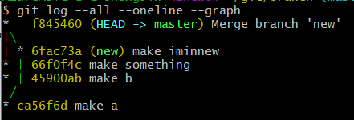

# Markdown?

### 1. 헤딩(Heading)

- 문서의 제목이나 소제목

 - #의 개수에 따라 제목의 수준을 구별(h1 ~ h6)
 - 문서 구조의 기본
 - 글자 크기를 키우기 위해서 사용x

### 2. 리스트(List)

- 순서가 있는 리스트와 순서가 없는 리스트
- 목록을 표시하기 위해 사용
- 많이 사용하는 태그 중 하나
- `1. ` : 순서가 있는 리스트 생성
- `- / *` : 순서가 없는 리스트 생성
- tab키를 이용해서 들여쓰기 가능

### 3. 코드 블럭(Code Block)

- 일반 텍스트와 다르게 코드를 이쁘게 출력

- 개발자가 마크다운을 사랑하는 이유 중 하나

- 사용하는 프로그램에 따라 특정 언어를 명시하면 구문 강조(Syntax Highlighting)

- ` ``` ` : 코드 블럭(python, java, c, c++ 등 모두 가능)

- ```python
  print(input())
  ```

### 4. 링크(Link) ` [string](url) `

- string은 보여지는 부분, url은 연결할 곳

- 다른 페이지로 이동하는 링크를 삽입

- 필요하다면 파일의 경로를 넣어 다운로드 가능한 링크로 만들 수 있다.

- http 잊지 않기(full link)

  

### 5. 텍스트 강조(Text Emphasis)

- 기울임 : `*텍스트*`혹은 `_글자_`
- 굵게 : `**텍스트**` 혹은 `__글자`
- 취소선 : `~~글자~~`
- 함께도 사용 가능


### 6. 이미지(Image) ``

- 이미지 삽입 가능
- 대체 텍스트 -> 이미지 정상적으로 불러오지 못했을 때 표시되는 문구


### 7. 인용(Blockquote)

- 주석이나 인용 문구 표현
- `>`를 사용, 갯수에 따라 중첩이 가능

> 인용문을 작성합니다.
>
> > 중첩된 인용문1
> >
> > > 중첩된 인용문2
> > >
> > > > 중첩된 인용문3
> > > >
> > > > > 중첩된 인용문4


### 8. 표(Table)

- 테이블(표)를 생성
- `파이프(|)`와 `하이폰(-)`을 이용해서 행과 열 구분
- 테이블 양쪽 끝의 `파이프(|)`는 생략 가능
- 헤더 셀을 구분할 때는 `3개 이상의 하이폰(-)`이 필요함
- Typora 에서는 `ctrl + T`를 통해서 쉽게 표 생성 가능
- 행을 늘릴 때 `ctrl + T`


### 9. 수평선(Horizontal Rule)

- 구분 선 생성
- `- * _`을 3번 이상 연속으로 작성


working directory -(git add)-> staging area -(git commit - m 'message(why)')-> commit area -(git push)-> repository

# **Git**

---

## 한 번만 해도 되는 작업

- `git config --global user.name [github_username]` : username 등록
- `git config --global user.name` : username 확인
- `git config --global user.email <github_email> ` : email 등록

- `git config --global user.email ` : email 확인

---

- `git init` : git 시작
- `git add`
  - `git add .` : 모든 파일 staging area에 올리기
  - `git add [file_name]`: 파일 staging area에 올리기 
- `git commit -m 'commit_message'`
- `git remote add origin [git_repository_url]` : repository 연결
- `git push origin master` : github로 밀어내기
  - `git push -u origin master`: 다음 push 때는 origin master 안 적어도 됨


#### gitignore

https://www.toptal.com/developers/gitignore


- clone : 아무 것도 없는 상태에서 레포를 끌어오는 것

- pull : 기존에 있는 것에서 레포를 업데이트(?) 하는 것 -> 다른 곳에서 수정한 것을 끌어옴


#### 가정

- 이미 레포지토리에 커밋이 올라가 있다.
- pull, push 하는 권한이 있다.

---

- 빈 폴더(상위 폴더에 깃이 없어야 함)에 clone 사용
  - `git clone {url}` -> 새로운 폴더를 만듦
  - `git clone {url} .`  -> 현재 폴더에 그대로

- do something and push commit
  - 원격 저장소가 원본 로컬 저장소보다 상위 버전이 됨.
- pull
  - 원본 로컬 저장소에서 원격 저장소의 commit을 pull 함
    - `git pull`


#### branch

- `git branch [branch_name]` : 새로운 branch 생성
- `git branch` : branch 확인
- `git merge [branch_name]` : branch와 합침 -> 기준이 될 branch에서
- `git branch -d [branch_name]` : branch 삭제
- `git switch [branch_name]` : branch 이동
  - `git switch -c 'branch_name'`: branch 생성 후 이동
  - `git checkout` : 과거에 사용했었음


- git log --oneline(한 줄로) --all(모든 branch의 log 확인 가능) --graph(branch의 방향을 눈으로 확인하기 쉬움)



- git merge 이후 conflict 생겼을 때 conflict 해결 후 git commit 자동으로 merge branch [합친 branch_name]이라는 메세지 생성
  - Fast-foward 메세지 : 잘 합쳐짐
